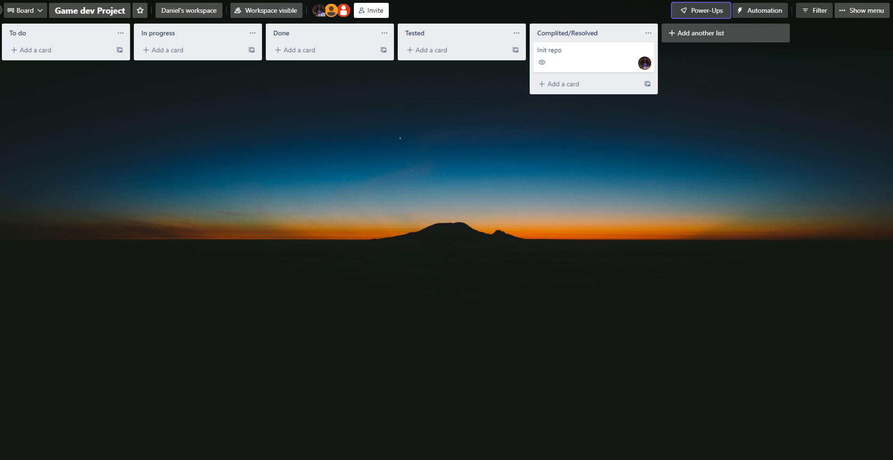

# Team and project
## Project A

>We are not officially enrolled in this course but we still wish to participate in it so if you will have time to check out our work it would be great. Thanks :)

## Team members list 
1. Sorpirit (@[Sorpirit](https://t.me/Sorpirit), Возовиков Д.Ю.) - **team leader**
2. OldStone 
3. Erbidium

## Unity version
2020.3.27f1

# Lab
## About team task management (screenshot/description)
We created a simple Trello board with this layout:

## Chosen games analysis
https://docs.google.com/document/d/1Xv9EkiEUOkQghgXLGNrwHiF5UClBq400riw8vBMNIfk/edit?usp=sharing